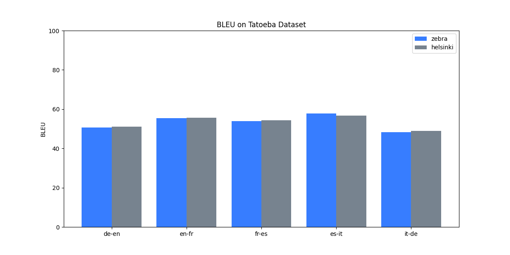
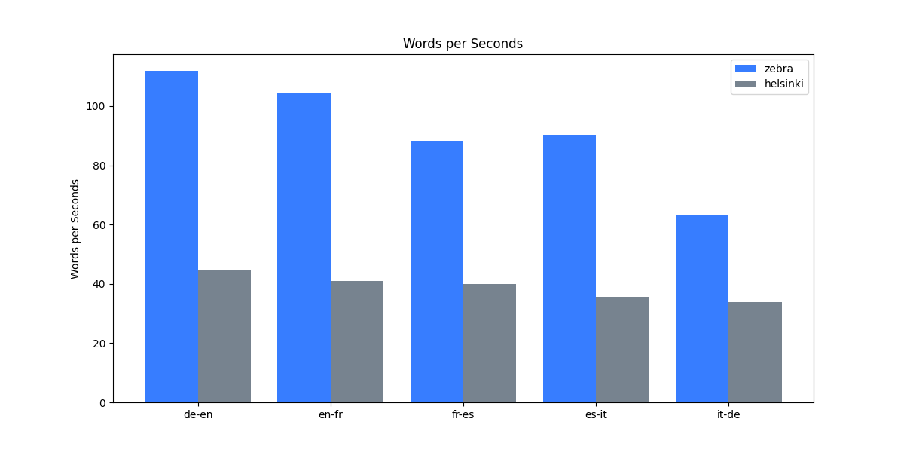
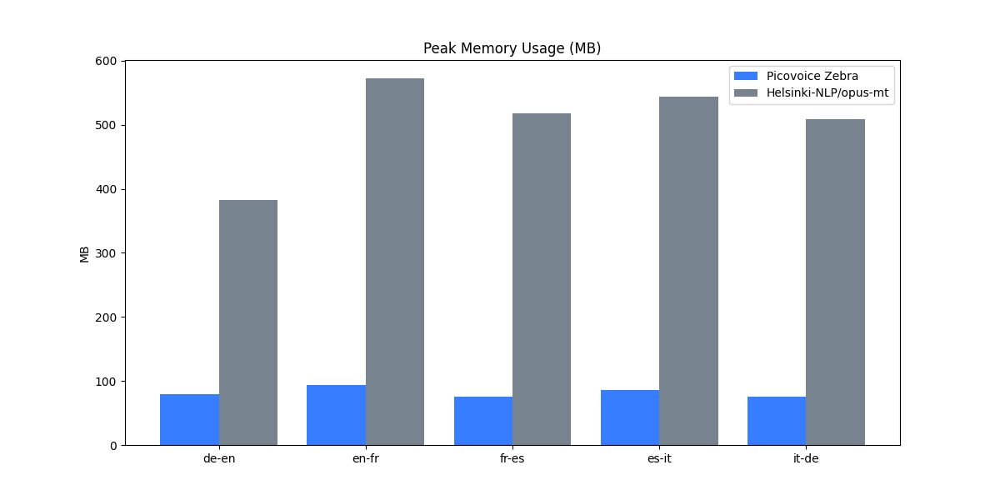

# Translation Benchmark

Made in Vancouver, Canada by [Picovoice](https://picovoice.ai)

This repo is a minimalist and extensible framework for benchmarking the accuracy and speed of different translation
engines.

## Table of Contents

- [Data](#data)
- [Engines](#engines)
- [Metrics](#metrics)
- [Usage](#usage)
- [Results](#results)

## Data

* [OPUS-MT-train](https://github.com/Helsinki-NLP/OPUS-MT-train)
* [Tatoeba-Challenge](https://github.com/Helsinki-NLP/Tatoeba-Challenge)

## Engines

We compare the accuracy and speed for the following Translation engines:

- [Helsinki-NLP/opus-mt](https://huggingface.co/Helsinki-NLP/opus-mt-en-fr)
- [Picovoice Zebra](https://picovoice.ai/platform/zebra/)

## Metrics

### Accuracy

The accuracy of the model is measured using `BLEU` and `chr-F`.

### Performance

Performance is measured in generated words per second and peak memory usage.

## Usage

This benchmark has been developed and tested on `Ubuntu 22.04`, using `Python 3.10`, and a consumer-grade AMD CPU
(`AMD Ryzen 9 5900X (12) @ 3.70GHz`).

### Install the requirements:

```console
pip3 install -r requirements.txt
```

In the following, we provide instructions for downloading and running the benchmark for each engine.
For each benchmark a source and target language is required. Replace `${SOURCE_LANGUAGE}` and `${TARGET_LANGUAGE}`
with it in the following instructions.

### Download the datasets:

Replace `${DATASET_PATH}` with the path to where you want the preprocessed dataset stored.
Replace `${OPUS_PATH}` with the path to where you downloaded [OPUS-MT-train](https://github.com/Helsinki-NLP/OPUS-MT-train).
Replace `${TATOEBA_PATH}` with the path to where you downloaded [Tatoeba-Challenge](https://github.com/Helsinki-NLP/Tatoeba-Challenge).

```console
python3 preprocess.py \
--dataset-path ${DATASET_PATH} \
--opus-path ${OPUS_PATH} \
--tatoeba-path ${TATOEBA_PATH} \
--source-language ${SOURCE_LANGUAGE} \
--target-language ${TARGET_LANGUAGE}
```

### Helsinki-NLP Instructions

Replace `${HELSINI_MODEL}` with the name of the Huggingface model you would like to use.

```console
python3 benchmark.py \
--source-language ${SOURCE_LANGUAGE} \
--target-language ${TARGET_LANGUAGE} \
--engine helsinki \
--helsinki-model-path ${HELSINI_MODEL}
```

### Picovoice Zebra Instructions

Replace `${PV_ACCESS_KEY}` with your Picovoice AccessKey. Replace `${ZEBRA_MODEL}` with the path to the zebra model you
would like to use.

```console
python3 benchmark.py \
--source-language ${SOURCE_LANGUAGE} \
--target-language ${TARGET_LANGUAGE} \
--engine zebra \
--picovoice-access-key ${PV_ACCESS_KEY} \
--zebra-model-path ${ZEBRA_MODEL}
```

## Results

This benchmark was run on cpu with *4* threads for the language pairs: de-en, en-fr, fr-es, es-it, and it-de. Zebra is
**2.4** times faster than the original model and uses **17.7%** of the RAM while maintaining **99.3%** of the accuracy of the
original model.

| Metric | Result |
|:-:|:-:|
| Accuracy | 99.3% |
| Performance | 2.4x |
| RAM Usage | 17.7% |



